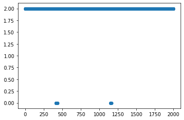

# Tracking data analysis using Python


```python
import pandas as pd
import numpy as np
import matplotlib.pyplot as plt
```


```python
# Import the data
data = pd.read_csv("tracking.txt", sep='\t')
data
```


<table class="data-frame"><thead><tr><th></th><th>xHead</th><th>yHead</th><th>tHead</th><th>xTail</th><th>yTail</th><th>tTail</th><th>xBody</th><th>yBody</th><th>tBody</th></tr><tr><th></th><th>Float64</th><th>Float64</th><th>Float64</th><th>Float64</th><th>Float64</th><th>Float64</th><th>Float64</th><th>Float64</th><th>Float64</th></tr></thead><tbody><p>2,475 rows × 23 columns (omitted printing of 14 columns)</p><tr><th>1</th><td>514.327</td><td>333.12</td><td>5.81619</td><td>499.96</td><td>327.727</td><td>6.10226</td><td>508.345</td><td>330.876</td><td>5.94395</td></tr><tr><th>2</th><td>463.603</td><td>327.051</td><td>0.301279</td><td>449.585</td><td>330.323</td><td>0.245547</td><td>458.058</td><td>328.346</td><td>0.238877</td></tr><tr><th>3</th><td>23.9978</td><td>287.715</td><td>3.70646</td><td>34.9722</td><td>278.836</td><td>3.99819</td><td>29.2056</td><td>283.505</td><td>3.84844</td></tr><tr><th>4</th><td>372.536</td><td>230.143</td><td>0.194641</td><td>354.226</td><td>231.604</td><td>6.08737</td><td>364.822</td><td>230.759</td><td>0.0515087</td></tr><tr><th>5</th><td>480.58</td><td>213.482</td><td>1.28236</td><td>478.125</td><td>228.52</td><td>1.53303</td><td>479.428</td><td>220.543</td><td>1.42567</td></tr><tr><th>6</th><td>171.682</td><td>143.55</td><td>6.09077</td><td>155.507</td><td>140.116</td><td>6.1146</td><td>164.913</td><td>142.113</td><td>6.08216</td></tr><tr><th>7</th><td>498.151</td><td>121.32</td><td>6.00177</td><td>483.712</td><td>119.285</td><td>0.0223247</td><td>492.683</td><td>120.55</td><td>6.15298</td></tr><tr><th>8</th><td>329.56</td><td>123.418</td><td>6.08726</td><td>312.526</td><td>119.042</td><td>5.9098</td><td>322.531</td><td>121.614</td><td>6.01722</td></tr><tr><th>9</th><td>465.256</td><td>115.045</td><td>4.44359</td><td>470.057</td><td>99.911</td><td>4.40559</td><td>467.106</td><td>109.205</td><td>4.40862</td></tr><tr><th>10</th><td>423.663</td><td>66.3789</td><td>0.0888056</td><td>409.105</td><td>67.2971</td><td>6.12053</td><td>417.615</td><td>66.7623</td><td>0.0292602</td></tr><tr><th>11</th><td>424.487</td><td>40.4232</td><td>5.48198</td><td>411.594</td><td>30.3912</td><td>5.88869</td><td>418.96</td><td>36.1192</td><td>5.64923</td></tr><tr><th>12</th><td>370.591</td><td>35.2147</td><td>5.99688</td><td>354.672</td><td>29.5633</td><td>5.89121</td><td>364.007</td><td>32.8767</td><td>5.94008</td></tr><tr><th>13</th><td>498.502</td><td>20.2527</td><td>5.66339</td><td>487.254</td><td>9.19499</td><td>5.39497</td><td>493.758</td><td>15.5781</td><td>5.5026</td></tr><tr><th>14</th><td>367.791</td><td>5.03034</td><td>6.05933</td><td>352.076</td><td>6.75603</td><td>0.653641</td><td>361.12</td><td>5.75904</td><td>0.152688</td></tr><tr><th>15</th><td>512.965</td><td>332.575</td><td>5.86617</td><td>499.435</td><td>327.759</td><td>6.052</td><td>507.626</td><td>330.673</td><td>5.95102</td></tr><tr><th>16</th><td>463.385</td><td>324.659</td><td>0.707</td><td>451.431</td><td>332.193</td><td>0.246265</td><td>458.959</td><td>327.443</td><td>0.542368</td></tr><tr><th>17</th><td>19.4579</td><td>293.022</td><td>4.28861</td><td>25.5579</td><td>281.206</td><td>4.18379</td><td>21.8962</td><td>288.302</td><td>4.23379</td></tr><tr><th>18</th><td>379.037</td><td>230.527</td><td>6.10571</td><td>361.728</td><td>229.616</td><td>0.199343</td><td>371.74</td><td>230.144</td><td>6.25939</td></tr><tr><th>19</th><td>478.884</td><td>206.712</td><td>1.27832</td><td>475.454</td><td>221.757</td><td>1.40929</td><td>477.197</td><td>214.108</td><td>1.35472</td></tr><tr><th>20</th><td>173.923</td><td>143.042</td><td>0.00732468</td><td>157.261</td><td>142.182</td><td>6.00453</td><td>167.066</td><td>142.689</td><td>6.20403</td></tr><tr><th>21</th><td>498.561</td><td>122.687</td><td>5.83253</td><td>486.357</td><td>118.196</td><td>6.13893</td><td>493.718</td><td>120.906</td><td>5.95151</td></tr><tr><th>22</th><td>328.812</td><td>124.134</td><td>6.05932</td><td>312.848</td><td>119.605</td><td>5.98617</td><td>322.331</td><td>122.294</td><td>6.00901</td></tr><tr><th>23</th><td>461.738</td><td>116.731</td><td>4.47649</td><td>466.371</td><td>101.736</td><td>4.40285</td><td>463.615</td><td>110.656</td><td>4.41641</td></tr><tr><th>24</th><td>428.631</td><td>69.2715</td><td>5.87139</td><td>415.665</td><td>64.6444</td><td>6.13862</td><td>423.218</td><td>67.3364</td><td>5.96558</td></tr><tr><th>25</th><td>425.821</td><td>44.9942</td><td>5.59983</td><td>414.84</td><td>33.2028</td><td>5.37159</td><td>421.248</td><td>40.0897</td><td>5.461</td></tr><tr><th>26</th><td>368.362</td><td>35.6219</td><td>5.97427</td><td>353.22</td><td>30.4625</td><td>5.88261</td><td>362.109</td><td>33.4891</td><td>5.94605</td></tr><tr><th>27</th><td>503.484</td><td>22.7293</td><td>5.76026</td><td>489.632</td><td>16.6315</td><td>5.92136</td><td>497.924</td><td>20.2857</td><td>5.86668</td></tr><tr><th>28</th><td>369.184</td><td>5.84074</td><td>6.15994</td><td>352.622</td><td>4.25328</td><td>6.24787</td><td>362.144</td><td>5.16766</td><td>6.19236</td></tr><tr><th>29</th><td>510.519</td><td>331.417</td><td>5.88883</td><td>495.784</td><td>327.366</td><td>6.12889</td><td>504.484</td><td>329.758</td><td>6.02088</td></tr><tr><th>30</th><td>464.242</td><td>323.533</td><td>0.290639</td><td>451.756</td><td>328.194</td><td>0.532686</td><td>459.432</td><td>325.326</td><td>0.37736</td></tr><tr><th>&vellip;</th><td>&vellip;</td><td>&vellip;</td><td>&vellip;</td><td>&vellip;</td><td>&vellip;</td><td>&vellip;</td><td>&vellip;</td><td>&vellip;</td><td>&vellip;</td></tr></tbody></table>

```python
# Count the number of detected object
objectNumber = len(set(data["id"].values))
objectNumber
```


    2


```python
# Count the number of image
imageNumber = np.max(data["imageNumber"]) + 1
imageNumber
```


    2000


```python
# Plot the number of objects detected by frame
objectByFrame = np.zeros(imageNumber)
for i in range(imageNumber):
    objectByFrame[i] = data[data["imageNumber"] == i].shape[0]
    
plt.scatter(range(imageNumber), objectByFrame)
```


    <matplotlib.collections.PathCollection at 0x7fa41831c6d8>





```python
# Plot the trajectory of the first object and its orientation
dataObject0 = data[data["id"] == 0]
distance = np.sqrt(np.diff(dataObject0["xBody"].values)**2 + np.diff(dataObject0["yBody"].values)**2)
framerate = 50
time = np.diff(dataObject0["imageNumber"].values)/framerate
velocity = distance/time

fig, ax = plt.subplots(1, 2)
fig.subplots_adjust(right = 2)

ax[0] = plt.subplot(121)
plot = ax[0].scatter(dataObject0["xBody"][0:-1], dataObject0["yBody"][0:-1], c = velocity, s = 1)
ax[0].set_xlabel("x-position")
ax[0].set_ylabel("y-position")
bar = fig.colorbar(plot)
bar.set_label("Velocity")

ax[1] = plt.subplot(122, projection='polar')
ax[1].scatter(range(dataObject0["tBody"].shape[0]), dataObject0["tBody"], s = 0.4)
ax[1].set_title("Object direction")

```


    Text(0.5, 1.05, 'Object direction')


```python

```
