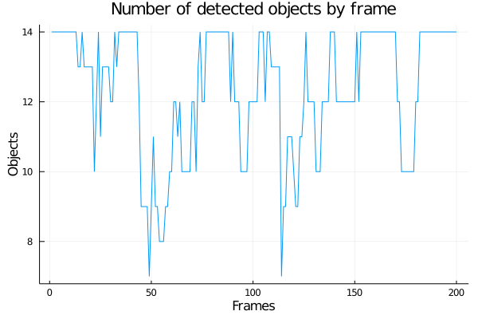
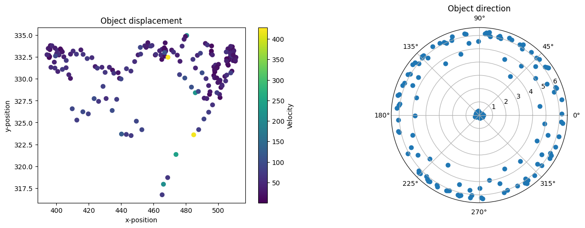
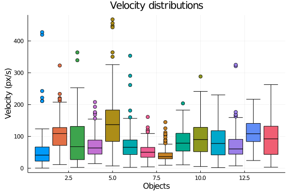

```
Copyright (C)  FastTrack.
Permission is granted to copy, distribute and/or modify this document.This program is distributed in the hope that it will be useful, but WITHOUT ANY WARRANTY; without even the implied warranty of MERCHANTABILITY or FITNESS FOR A PARTICULAR PURPOSE.
```

## Data analysis using Julia

### Introduction

The Julia documentation and installation guide can be found at [https://julialang.org/](https://julialang.org/). We provide here a simple example that details how to import the `tracking.txt` file from FastTrack, and how to extract basic information like the number of objects, the number of images etc...


```julia
using DataFrames
using CSV
using PyPlot
using Plots
using StatsPlots
```

### Importation

We are going to import the tracking file in a DataFrames. Note that the user needs to provide the full path to the `tracking.txt` file.


```julia
data = CSV.read("tracking.txt", delim='\t', DataFrame)
display(data)
```


<table class="data-frame"><thead><tr><th></th><th>xHead</th><th>yHead</th><th>tHead</th><th>xTail</th><th>yTail</th><th>tTail</th><th>xBody</th><th>yBody</th><th>tBody</th></tr><tr><th></th><th>Float64</th><th>Float64</th><th>Float64</th><th>Float64</th><th>Float64</th><th>Float64</th><th>Float64</th><th>Float64</th><th>Float64</th></tr></thead><tbody><p>2,475 rows × 23 columns (omitted printing of 14 columns)</p><tr><th>1</th><td>514.327</td><td>333.12</td><td>5.81619</td><td>499.96</td><td>327.727</td><td>6.10226</td><td>508.345</td><td>330.876</td><td>5.94395</td></tr><tr><th>2</th><td>463.603</td><td>327.051</td><td>0.301279</td><td>449.585</td><td>330.323</td><td>0.245547</td><td>458.058</td><td>328.346</td><td>0.238877</td></tr><tr><th>3</th><td>23.9978</td><td>287.715</td><td>3.70646</td><td>34.9722</td><td>278.836</td><td>3.99819</td><td>29.2056</td><td>283.505</td><td>3.84844</td></tr><tr><th>4</th><td>372.536</td><td>230.143</td><td>0.194641</td><td>354.226</td><td>231.604</td><td>6.08737</td><td>364.822</td><td>230.759</td><td>0.0515087</td></tr><tr><th>5</th><td>480.58</td><td>213.482</td><td>1.28236</td><td>478.125</td><td>228.52</td><td>1.53303</td><td>479.428</td><td>220.543</td><td>1.42567</td></tr><tr><th>6</th><td>171.682</td><td>143.55</td><td>6.09077</td><td>155.507</td><td>140.116</td><td>6.1146</td><td>164.913</td><td>142.113</td><td>6.08216</td></tr><tr><th>7</th><td>498.151</td><td>121.32</td><td>6.00177</td><td>483.712</td><td>119.285</td><td>0.0223247</td><td>492.683</td><td>120.55</td><td>6.15298</td></tr><tr><th>8</th><td>329.56</td><td>123.418</td><td>6.08726</td><td>312.526</td><td>119.042</td><td>5.9098</td><td>322.531</td><td>121.614</td><td>6.01722</td></tr><tr><th>9</th><td>465.256</td><td>115.045</td><td>4.44359</td><td>470.057</td><td>99.911</td><td>4.40559</td><td>467.106</td><td>109.205</td><td>4.40862</td></tr><tr><th>10</th><td>423.663</td><td>66.3789</td><td>0.0888056</td><td>409.105</td><td>67.2971</td><td>6.12053</td><td>417.615</td><td>66.7623</td><td>0.0292602</td></tr><tr><th>11</th><td>424.487</td><td>40.4232</td><td>5.48198</td><td>411.594</td><td>30.3912</td><td>5.88869</td><td>418.96</td><td>36.1192</td><td>5.64923</td></tr><tr><th>12</th><td>370.591</td><td>35.2147</td><td>5.99688</td><td>354.672</td><td>29.5633</td><td>5.89121</td><td>364.007</td><td>32.8767</td><td>5.94008</td></tr><tr><th>13</th><td>498.502</td><td>20.2527</td><td>5.66339</td><td>487.254</td><td>9.19499</td><td>5.39497</td><td>493.758</td><td>15.5781</td><td>5.5026</td></tr><tr><th>14</th><td>367.791</td><td>5.03034</td><td>6.05933</td><td>352.076</td><td>6.75603</td><td>0.653641</td><td>361.12</td><td>5.75904</td><td>0.152688</td></tr><tr><th>15</th><td>512.965</td><td>332.575</td><td>5.86617</td><td>499.435</td><td>327.759</td><td>6.052</td><td>507.626</td><td>330.673</td><td>5.95102</td></tr><tr><th>16</th><td>463.385</td><td>324.659</td><td>0.707</td><td>451.431</td><td>332.193</td><td>0.246265</td><td>458.959</td><td>327.443</td><td>0.542368</td></tr><tr><th>17</th><td>19.4579</td><td>293.022</td><td>4.28861</td><td>25.5579</td><td>281.206</td><td>4.18379</td><td>21.8962</td><td>288.302</td><td>4.23379</td></tr><tr><th>18</th><td>379.037</td><td>230.527</td><td>6.10571</td><td>361.728</td><td>229.616</td><td>0.199343</td><td>371.74</td><td>230.144</td><td>6.25939</td></tr><tr><th>19</th><td>478.884</td><td>206.712</td><td>1.27832</td><td>475.454</td><td>221.757</td><td>1.40929</td><td>477.197</td><td>214.108</td><td>1.35472</td></tr><tr><th>20</th><td>173.923</td><td>143.042</td><td>0.00732468</td><td>157.261</td><td>142.182</td><td>6.00453</td><td>167.066</td><td>142.689</td><td>6.20403</td></tr><tr><th>21</th><td>498.561</td><td>122.687</td><td>5.83253</td><td>486.357</td><td>118.196</td><td>6.13893</td><td>493.718</td><td>120.906</td><td>5.95151</td></tr><tr><th>22</th><td>328.812</td><td>124.134</td><td>6.05932</td><td>312.848</td><td>119.605</td><td>5.98617</td><td>322.331</td><td>122.294</td><td>6.00901</td></tr><tr><th>23</th><td>461.738</td><td>116.731</td><td>4.47649</td><td>466.371</td><td>101.736</td><td>4.40285</td><td>463.615</td><td>110.656</td><td>4.41641</td></tr><tr><th>24</th><td>428.631</td><td>69.2715</td><td>5.87139</td><td>415.665</td><td>64.6444</td><td>6.13862</td><td>423.218</td><td>67.3364</td><td>5.96558</td></tr><tr><th>25</th><td>425.821</td><td>44.9942</td><td>5.59983</td><td>414.84</td><td>33.2028</td><td>5.37159</td><td>421.248</td><td>40.0897</td><td>5.461</td></tr><tr><th>26</th><td>368.362</td><td>35.6219</td><td>5.97427</td><td>353.22</td><td>30.4625</td><td>5.88261</td><td>362.109</td><td>33.4891</td><td>5.94605</td></tr><tr><th>27</th><td>503.484</td><td>22.7293</td><td>5.76026</td><td>489.632</td><td>16.6315</td><td>5.92136</td><td>497.924</td><td>20.2857</td><td>5.86668</td></tr><tr><th>28</th><td>369.184</td><td>5.84074</td><td>6.15994</td><td>352.622</td><td>4.25328</td><td>6.24787</td><td>362.144</td><td>5.16766</td><td>6.19236</td></tr><tr><th>29</th><td>510.519</td><td>331.417</td><td>5.88883</td><td>495.784</td><td>327.366</td><td>6.12889</td><td>504.484</td><td>329.758</td><td>6.02088</td></tr><tr><th>30</th><td>464.242</td><td>323.533</td><td>0.290639</td><td>451.756</td><td>328.194</td><td>0.532686</td><td>459.432</td><td>325.326</td><td>0.37736</td></tr><tr><th>&vellip;</th><td>&vellip;</td><td>&vellip;</td><td>&vellip;</td><td>&vellip;</td><td>&vellip;</td><td>&vellip;</td><td>&vellip;</td><td>&vellip;</td><td>&vellip;</td></tr></tbody></table>


### Basic information

We are going to extract the basic tracking information:
* Object's id
* Number of objects
* Number of images
* Number of images with at least one object detected


```julia
objects = Set(data.id)
print("Objects id: ", objects)
```

    Objects id: Set([10, 5, 9, 8, 13, 4, 1, 0, 12, 7, 11, 2, 3, 6])


```julia
numObjects = length(objects)
print("Number of objects: ", numObjects)
```

    Number of objects: 14


```julia
numImages = maximum(data.imageNumber) + 1 # Image index starting at 0
print("Number of images: ", numImages)
```

    Number of images: 200


```julia
numDetected = length(Set(data.imageNumber))
print("Number of images with at least one object detected: ", numDetected)
```

    Number of images with at least one object detected: 200

### Basic plots

We are going to make basic plots using Plots, StatsPlots and the PyPlot (that require a valid matplotlib installation)  modules. For more information about plotting see [https://docs.juliaplots.org/latest/tutorial/](https://docs.juliaplots.org/latest/tutorial/).


```julia
objectsByImage = zeros(numImages)
for i in 1:numImages
    objectsByImage[i] = length(Set(data.id[data.imageNumber .== i-1]))
end
Plots.plot(1:numImages, objectsByImage; title="Number of detected objects by frame", xlabel="Frames", ylabel="Objects", label=false)
```





```julia
dataObject0 = data[data.id .== 0, :]
distance = sqrt.(diff(dataObject0.xBody).^2 + diff(dataObject0.yBody).^2)
framerate = 25
time = diff(dataObject0.imageNumber)/framerate
velocity = distance./time

fig, ax = PyPlot.subplots(1, 2)
fig.subplots_adjust(right = 2)

ax[1] = PyPlot.subplot(121)
plot = ax[1].scatter(dataObject0.xBody[1:end-1], dataObject0.yBody[1:end-1], c=velocity, s=40)
ax[1].set_title("Object displacement")
ax[1].set_xlabel("x-position")
ax[1].set_ylabel("y-position")
bar = fig.colorbar(plot)
bar.set_label("Velocity")

ax[2] = PyPlot.subplot(122, projection="polar")
ax[2].scatter(1:length(dataObject0.tBody), dataObject0.tBody, s=40)
ax[2].set_title("Object direction")
```





    PyObject Text(0.5, 1.0715488215488216, 'Object direction')


```julia
velocities = Any[]
for i in 1:numObjects
    distance = sqrt.(diff(data.xBody[data.id .== i-1]).^2 + diff(data.yBody[data.id .== i-1]).^2)
    time = diff(data.imageNumber[data.id .== i-1])/25
    velocity = distance./time
    append!(velocities, [velocity])
end
StatsPlots.boxplot(velocities, label=false, title="Velocity distributions", ylabel="Velocity (px/s)", xlabel="Objects")
```





```julia

```
