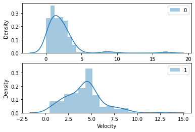
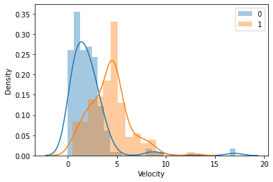
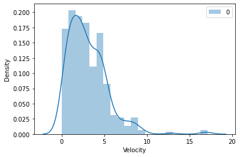
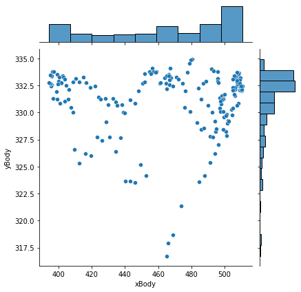
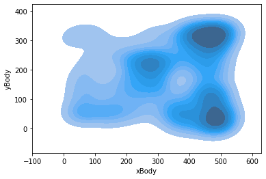
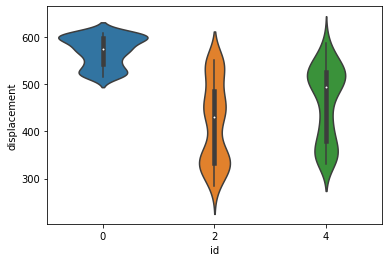
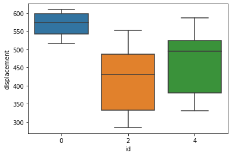
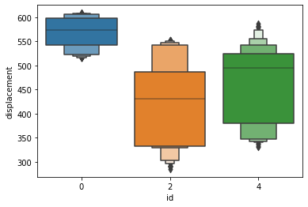

```
Copyright (C)  FastTrack.
Permission is granted to copy, distribute and/or modify this document.This program is distributed in the hope that it will be useful, but WITHOUT ANY WARRANTY; without even the implied warranty of MERCHANTABILITY or FITNESS FOR A PARTICULAR PURPOSE.
```
# Get started with FastAnalysis
FastAnalysis is a python library that simplifies the importation of a tracking analysis performed with FastTrack. Easily select data for a given object or a given timepoint.

## Package installation
The FastAnalysis package can be installed following the provided instruction at https://github.com/FastTrackOrg/FastAnalysis.


```python
import sys
!{sys.executable} -m pip install fastanalysis
```

## Package usage


```python
import fastanalysis as fa
```

### Load the tracking data and get the basic information.


```python
data = fa.Load("tracking.txt")
```


```python
print("Total objects: ", data.getObjectNumber())
```

    Total objects:  14


```python
print("Keys: ", data.getKeys())
```

    Keys:  ['xHead', 'yHead', 'tHead', 'xTail', 'yTail', 'tTail', 'xBody', 'yBody', 'tBody', 'curvature', 'areaBody', 'perimeterBody', 'headMajorAxisLength', 'headMinorAxisLength', 'headExcentricity', 'tailMajorAxisLength', 'tailMinorAxisLength', 'tailExcentricity', 'bodyMajorAxisLength', 'bodyMinorAxisLength', 'bodyExcentricity', 'imageNumber', 'id']


### Select the tracking data for a given object


```python
data.getObjects(0)
```


<div>
<table border="1" class="dataframe">
  <thead>
    <tr>
      <th></th>
      <th>xHead</th>
      <th>yHead</th>
      <th>tHead</th>
      <th>xTail</th>
      <th>yTail</th>
      <th>tTail</th>
      <th>xBody</th>
      <th>yBody</th>
      <th>tBody</th>
      <th>curvature</th>
      <th>...</th>
      <th>headMinorAxisLength</th>
      <th>headExcentricity</th>
      <th>tailMajorAxisLength</th>
      <th>tailMinorAxisLength</th>
      <th>tailExcentricity</th>
      <th>bodyMajorAxisLength</th>
      <th>bodyMinorAxisLength</th>
      <th>bodyExcentricity</th>
      <th>imageNumber</th>
      <th>id</th>
    </tr>
  </thead>
  <tbody>
    <tr>
      <th>0</th>
      <td>514.327</td>
      <td>333.120</td>
      <td>5.816190</td>
      <td>499.960</td>
      <td>327.727</td>
      <td>6.102260</td>
      <td>508.345</td>
      <td>330.876</td>
      <td>5.943950</td>
      <td>0.000348</td>
      <td>...</td>
      <td>2.98626</td>
      <td>0.921388</td>
      <td>11.40750</td>
      <td>2.06461</td>
      <td>0.983485</td>
      <td>17.7578</td>
      <td>2.86227</td>
      <td>0.986924</td>
      <td>0</td>
      <td>0</td>
    </tr>
    <tr>
      <th>14</th>
      <td>512.965</td>
      <td>332.575</td>
      <td>5.866170</td>
      <td>499.435</td>
      <td>327.759</td>
      <td>6.052000</td>
      <td>507.626</td>
      <td>330.673</td>
      <td>5.951020</td>
      <td>0.000370</td>
      <td>...</td>
      <td>2.94920</td>
      <td>0.921589</td>
      <td>10.63010</td>
      <td>1.79632</td>
      <td>0.985619</td>
      <td>16.5912</td>
      <td>2.55900</td>
      <td>0.988034</td>
      <td>1</td>
      <td>0</td>
    </tr>
    <tr>
      <th>28</th>
      <td>510.519</td>
      <td>331.417</td>
      <td>5.888830</td>
      <td>495.784</td>
      <td>327.366</td>
      <td>6.128890</td>
      <td>504.484</td>
      <td>329.758</td>
      <td>6.020880</td>
      <td>0.000285</td>
      <td>...</td>
      <td>3.02647</td>
      <td>0.931937</td>
      <td>11.80820</td>
      <td>1.97610</td>
      <td>0.985898</td>
      <td>17.9581</td>
      <td>2.76152</td>
      <td>0.988106</td>
      <td>2</td>
      <td>0</td>
    </tr>
    <tr>
      <th>42</th>
      <td>508.379</td>
      <td>330.542</td>
      <td>5.978240</td>
      <td>493.210</td>
      <td>327.460</td>
      <td>6.159440</td>
      <td>502.213</td>
      <td>329.291</td>
      <td>6.083920</td>
      <td>0.000217</td>
      <td>...</td>
      <td>3.10027</td>
      <td>0.928649</td>
      <td>11.67010</td>
      <td>1.97623</td>
      <td>0.985558</td>
      <td>18.0820</td>
      <td>2.70641</td>
      <td>0.988735</td>
      <td>3</td>
      <td>0</td>
    </tr>
    <tr>
      <th>56</th>
      <td>503.990</td>
      <td>331.764</td>
      <td>4.889370</td>
      <td>496.990</td>
      <td>322.509</td>
      <td>6.183440</td>
      <td>501.029</td>
      <td>327.856</td>
      <td>5.378760</td>
      <td>0.001812</td>
      <td>...</td>
      <td>2.92067</td>
      <td>0.914680</td>
      <td>8.25174</td>
      <td>3.01276</td>
      <td>0.930966</td>
      <td>13.0947</td>
      <td>5.19418</td>
      <td>0.917965</td>
      <td>4</td>
      <td>0</td>
    </tr>
    <tr>
      <th>...</th>
      <td>...</td>
      <td>...</td>
      <td>...</td>
      <td>...</td>
      <td>...</td>
      <td>...</td>
      <td>...</td>
      <td>...</td>
      <td>...</td>
      <td>...</td>
      <td>...</td>
      <td>...</td>
      <td>...</td>
      <td>...</td>
      <td>...</td>
      <td>...</td>
      <td>...</td>
      <td>...</td>
      <td>...</td>
      <td>...</td>
      <td>...</td>
    </tr>
    <tr>
      <th>2414</th>
      <td>515.720</td>
      <td>332.233</td>
      <td>0.047758</td>
      <td>504.152</td>
      <td>332.758</td>
      <td>6.219550</td>
      <td>510.844</td>
      <td>332.456</td>
      <td>0.031550</td>
      <td>0.000053</td>
      <td>...</td>
      <td>2.83620</td>
      <td>0.891031</td>
      <td>7.96985</td>
      <td>2.21498</td>
      <td>0.960604</td>
      <td>13.3794</td>
      <td>2.48061</td>
      <td>0.982662</td>
      <td>195</td>
      <td>0</td>
    </tr>
    <tr>
      <th>2428</th>
      <td>514.518</td>
      <td>331.229</td>
      <td>6.173800</td>
      <td>502.533</td>
      <td>333.448</td>
      <td>0.410982</td>
      <td>509.848</td>
      <td>332.091</td>
      <td>0.188133</td>
      <td>0.000454</td>
      <td>...</td>
      <td>3.01448</td>
      <td>0.895229</td>
      <td>9.27558</td>
      <td>1.86710</td>
      <td>0.979531</td>
      <td>14.0909</td>
      <td>3.11860</td>
      <td>0.975201</td>
      <td>196</td>
      <td>0</td>
    </tr>
    <tr>
      <th>2442</th>
      <td>515.022</td>
      <td>333.301</td>
      <td>6.039930</td>
      <td>503.432</td>
      <td>330.360</td>
      <td>6.110450</td>
      <td>510.456</td>
      <td>332.144</td>
      <td>6.046190</td>
      <td>0.000040</td>
      <td>...</td>
      <td>2.86268</td>
      <td>0.894578</td>
      <td>8.45494</td>
      <td>1.97392</td>
      <td>0.972365</td>
      <td>13.7423</td>
      <td>2.44318</td>
      <td>0.984069</td>
      <td>197</td>
      <td>0</td>
    </tr>
    <tr>
      <th>2456</th>
      <td>514.364</td>
      <td>332.322</td>
      <td>0.089009</td>
      <td>501.409</td>
      <td>333.271</td>
      <td>6.061220</td>
      <td>509.183</td>
      <td>332.699</td>
      <td>0.030277</td>
      <td>0.000309</td>
      <td>...</td>
      <td>2.70609</td>
      <td>0.926143</td>
      <td>9.87331</td>
      <td>2.72056</td>
      <td>0.961288</td>
      <td>15.0990</td>
      <td>3.04030</td>
      <td>0.979518</td>
      <td>198</td>
      <td>0</td>
    </tr>
    <tr>
      <th>2470</th>
      <td>514.682</td>
      <td>333.174</td>
      <td>6.045460</td>
      <td>503.418</td>
      <td>331.482</td>
      <td>0.110999</td>
      <td>510.000</td>
      <td>332.472</td>
      <td>6.164560</td>
      <td>0.000434</td>
      <td>...</td>
      <td>2.90509</td>
      <td>0.881178</td>
      <td>8.31982</td>
      <td>2.31197</td>
      <td>0.960614</td>
      <td>13.2119</td>
      <td>2.86264</td>
      <td>0.976245</td>
      <td>199</td>
      <td>0</td>
    </tr>
  </tbody>
</table>
<p>190 rows × 23 columns</p>
</div>


### Select the tracking data for a list of objects


```python
data.getObjects([0, 2, 4])
```


<div>
<table border="1" class="dataframe">
  <thead>
    <tr>
      <th></th>
      <th>xHead</th>
      <th>yHead</th>
      <th>tHead</th>
      <th>xTail</th>
      <th>yTail</th>
      <th>tTail</th>
      <th>xBody</th>
      <th>yBody</th>
      <th>tBody</th>
      <th>curvature</th>
      <th>...</th>
      <th>headMinorAxisLength</th>
      <th>headExcentricity</th>
      <th>tailMajorAxisLength</th>
      <th>tailMinorAxisLength</th>
      <th>tailExcentricity</th>
      <th>bodyMajorAxisLength</th>
      <th>bodyMinorAxisLength</th>
      <th>bodyExcentricity</th>
      <th>imageNumber</th>
      <th>id</th>
    </tr>
  </thead>
  <tbody>
    <tr>
      <th>0</th>
      <td>514.3270</td>
      <td>333.120</td>
      <td>5.816190</td>
      <td>499.9600</td>
      <td>327.727</td>
      <td>6.102260</td>
      <td>508.3450</td>
      <td>330.876</td>
      <td>5.943950</td>
      <td>0.000348</td>
      <td>...</td>
      <td>2.98626</td>
      <td>0.921388</td>
      <td>11.40750</td>
      <td>2.06461</td>
      <td>0.983485</td>
      <td>17.7578</td>
      <td>2.86227</td>
      <td>0.986924</td>
      <td>0</td>
      <td>0</td>
    </tr>
    <tr>
      <th>2</th>
      <td>23.9978</td>
      <td>287.715</td>
      <td>3.706460</td>
      <td>34.9722</td>
      <td>278.836</td>
      <td>3.998190</td>
      <td>29.2056</td>
      <td>283.505</td>
      <td>3.848440</td>
      <td>0.000714</td>
      <td>...</td>
      <td>3.02224</td>
      <td>0.878284</td>
      <td>11.09250</td>
      <td>2.61304</td>
      <td>0.971858</td>
      <td>16.5670</td>
      <td>3.00962</td>
      <td>0.983361</td>
      <td>0</td>
      <td>2</td>
    </tr>
    <tr>
      <th>4</th>
      <td>480.5800</td>
      <td>213.482</td>
      <td>1.282360</td>
      <td>478.1250</td>
      <td>228.520</td>
      <td>1.533030</td>
      <td>479.4280</td>
      <td>220.543</td>
      <td>1.425670</td>
      <td>0.000539</td>
      <td>...</td>
      <td>3.45208</td>
      <td>0.873828</td>
      <td>11.80360</td>
      <td>2.22489</td>
      <td>0.982075</td>
      <td>17.9204</td>
      <td>3.02978</td>
      <td>0.985604</td>
      <td>0</td>
      <td>4</td>
    </tr>
    <tr>
      <th>14</th>
      <td>512.9650</td>
      <td>332.575</td>
      <td>5.866170</td>
      <td>499.4350</td>
      <td>327.759</td>
      <td>6.052000</td>
      <td>507.6260</td>
      <td>330.673</td>
      <td>5.951020</td>
      <td>0.000370</td>
      <td>...</td>
      <td>2.94920</td>
      <td>0.921589</td>
      <td>10.63010</td>
      <td>1.79632</td>
      <td>0.985619</td>
      <td>16.5912</td>
      <td>2.55900</td>
      <td>0.988034</td>
      <td>1</td>
      <td>0</td>
    </tr>
    <tr>
      <th>16</th>
      <td>19.4579</td>
      <td>293.022</td>
      <td>4.288610</td>
      <td>25.5579</td>
      <td>281.206</td>
      <td>4.183790</td>
      <td>21.8962</td>
      <td>288.302</td>
      <td>4.233790</td>
      <td>0.000041</td>
      <td>...</td>
      <td>3.10527</td>
      <td>0.893777</td>
      <td>8.95453</td>
      <td>1.95308</td>
      <td>0.975924</td>
      <td>15.1497</td>
      <td>2.60690</td>
      <td>0.985084</td>
      <td>1</td>
      <td>2</td>
    </tr>
    <tr>
      <th>...</th>
      <td>...</td>
      <td>...</td>
      <td>...</td>
      <td>...</td>
      <td>...</td>
      <td>...</td>
      <td>...</td>
      <td>...</td>
      <td>...</td>
      <td>...</td>
      <td>...</td>
      <td>...</td>
      <td>...</td>
      <td>...</td>
      <td>...</td>
      <td>...</td>
      <td>...</td>
      <td>...</td>
      <td>...</td>
      <td>...</td>
      <td>...</td>
    </tr>
    <tr>
      <th>2449</th>
      <td>477.5150</td>
      <td>253.259</td>
      <td>0.494507</td>
      <td>466.0410</td>
      <td>261.018</td>
      <td>0.831531</td>
      <td>472.8820</td>
      <td>256.382</td>
      <td>0.622416</td>
      <td>0.000357</td>
      <td>...</td>
      <td>3.18330</td>
      <td>0.890322</td>
      <td>9.94944</td>
      <td>2.33195</td>
      <td>0.972145</td>
      <td>15.8464</td>
      <td>3.12130</td>
      <td>0.980409</td>
      <td>198</td>
      <td>2</td>
    </tr>
    <tr>
      <th>2456</th>
      <td>514.3640</td>
      <td>332.322</td>
      <td>0.089009</td>
      <td>501.4090</td>
      <td>333.271</td>
      <td>6.061220</td>
      <td>509.1830</td>
      <td>332.699</td>
      <td>0.030277</td>
      <td>0.000309</td>
      <td>...</td>
      <td>2.70609</td>
      <td>0.926143</td>
      <td>9.87331</td>
      <td>2.72056</td>
      <td>0.961288</td>
      <td>15.0990</td>
      <td>3.04030</td>
      <td>0.979518</td>
      <td>198</td>
      <td>0</td>
    </tr>
    <tr>
      <th>2462</th>
      <td>413.9010</td>
      <td>332.386</td>
      <td>5.582420</td>
      <td>401.1560</td>
      <td>322.815</td>
      <td>5.799440</td>
      <td>408.5330</td>
      <td>328.356</td>
      <td>5.657920</td>
      <td>0.000666</td>
      <td>...</td>
      <td>3.24954</td>
      <td>0.920555</td>
      <td>11.51030</td>
      <td>2.47230</td>
      <td>0.976660</td>
      <td>18.4979</td>
      <td>3.05143</td>
      <td>0.986300</td>
      <td>199</td>
      <td>4</td>
    </tr>
    <tr>
      <th>2463</th>
      <td>479.2630</td>
      <td>250.716</td>
      <td>0.644442</td>
      <td>465.5060</td>
      <td>258.476</td>
      <td>0.362501</td>
      <td>473.8190</td>
      <td>253.784</td>
      <td>0.503416</td>
      <td>0.000200</td>
      <td>...</td>
      <td>2.96435</td>
      <td>0.930262</td>
      <td>11.55250</td>
      <td>1.76407</td>
      <td>0.988273</td>
      <td>18.1329</td>
      <td>2.75170</td>
      <td>0.988419</td>
      <td>199</td>
      <td>2</td>
    </tr>
    <tr>
      <th>2470</th>
      <td>514.6820</td>
      <td>333.174</td>
      <td>6.045460</td>
      <td>503.4180</td>
      <td>331.482</td>
      <td>0.110999</td>
      <td>510.0000</td>
      <td>332.472</td>
      <td>6.164560</td>
      <td>0.000434</td>
      <td>...</td>
      <td>2.90509</td>
      <td>0.881178</td>
      <td>8.31982</td>
      <td>2.31197</td>
      <td>0.960614</td>
      <td>13.2119</td>
      <td>2.86264</td>
      <td>0.976245</td>
      <td>199</td>
      <td>0</td>
    </tr>
  </tbody>
</table>
<p>544 rows × 23 columns</p>
</div>


### Select the tracking data for a given image


```python
data.getFrames(100)
```


<div>
<table border="1" class="dataframe">
  <thead>
    <tr>
      <th></th>
      <th>xHead</th>
      <th>yHead</th>
      <th>tHead</th>
      <th>xTail</th>
      <th>yTail</th>
      <th>tTail</th>
      <th>xBody</th>
      <th>yBody</th>
      <th>tBody</th>
      <th>curvature</th>
      <th>...</th>
      <th>headMinorAxisLength</th>
      <th>headExcentricity</th>
      <th>tailMajorAxisLength</th>
      <th>tailMinorAxisLength</th>
      <th>tailExcentricity</th>
      <th>bodyMajorAxisLength</th>
      <th>bodyMinorAxisLength</th>
      <th>bodyExcentricity</th>
      <th>imageNumber</th>
      <th>id</th>
    </tr>
  </thead>
  <tbody>
    <tr>
      <th>1220</th>
      <td>471.9020</td>
      <td>331.89000</td>
      <td>0.269094</td>
      <td>460.4110</td>
      <td>335.5360</td>
      <td>0.205151</td>
      <td>467.340</td>
      <td>333.3400</td>
      <td>0.285930</td>
      <td>0.000054</td>
      <td>...</td>
      <td>3.02325</td>
      <td>0.879342</td>
      <td>9.4287</td>
      <td>2.36285</td>
      <td>0.968090</td>
      <td>14.0688</td>
      <td>2.71188</td>
      <td>0.981246</td>
      <td>100</td>
      <td>0</td>
    </tr>
    <tr>
      <th>1221</th>
      <td>394.0560</td>
      <td>311.18300</td>
      <td>5.862420</td>
      <td>380.7090</td>
      <td>302.9660</td>
      <td>5.533100</td>
      <td>388.653</td>
      <td>307.8680</td>
      <td>5.710570</td>
      <td>0.000782</td>
      <td>...</td>
      <td>3.18665</td>
      <td>0.911141</td>
      <td>12.0567</td>
      <td>2.13218</td>
      <td>0.984238</td>
      <td>18.0280</td>
      <td>3.11668</td>
      <td>0.984943</td>
      <td>100</td>
      <td>9</td>
    </tr>
    <tr>
      <th>1222</th>
      <td>294.9150</td>
      <td>323.62100</td>
      <td>5.928470</td>
      <td>280.3880</td>
      <td>319.3940</td>
      <td>6.078460</td>
      <td>289.216</td>
      <td>321.9640</td>
      <td>6.006340</td>
      <td>0.000511</td>
      <td>...</td>
      <td>3.08521</td>
      <td>0.908041</td>
      <td>11.1557</td>
      <td>1.66443</td>
      <td>0.988807</td>
      <td>17.2867</td>
      <td>2.57567</td>
      <td>0.988838</td>
      <td>100</td>
      <td>2</td>
    </tr>
    <tr>
      <th>1223</th>
      <td>219.1200</td>
      <td>191.08900</td>
      <td>0.631238</td>
      <td>205.3180</td>
      <td>198.1280</td>
      <td>0.088934</td>
      <td>213.337</td>
      <td>194.0410</td>
      <td>0.437513</td>
      <td>0.000843</td>
      <td>...</td>
      <td>3.96058</td>
      <td>0.881927</td>
      <td>10.6798</td>
      <td>3.26638</td>
      <td>0.952081</td>
      <td>17.7698</td>
      <td>4.40737</td>
      <td>0.968753</td>
      <td>100</td>
      <td>3</td>
    </tr>
    <tr>
      <th>1224</th>
      <td>191.9850</td>
      <td>48.83960</td>
      <td>1.338080</td>
      <td>185.1600</td>
      <td>62.8722</td>
      <td>0.851539</td>
      <td>188.648</td>
      <td>55.6479</td>
      <td>1.073240</td>
      <td>0.001664</td>
      <td>...</td>
      <td>3.49889</td>
      <td>0.867101</td>
      <td>12.0051</td>
      <td>2.62074</td>
      <td>0.975881</td>
      <td>18.3914</td>
      <td>3.78692</td>
      <td>0.978572</td>
      <td>100</td>
      <td>5</td>
    </tr>
    <tr>
      <th>1225</th>
      <td>504.0520</td>
      <td>9.82832</td>
      <td>0.558700</td>
      <td>489.4620</td>
      <td>18.4243</td>
      <td>0.514300</td>
      <td>497.878</td>
      <td>13.4694</td>
      <td>0.531725</td>
      <td>0.000089</td>
      <td>...</td>
      <td>3.41134</td>
      <td>0.912303</td>
      <td>12.3365</td>
      <td>1.99489</td>
      <td>0.986839</td>
      <td>19.5719</td>
      <td>2.78473</td>
      <td>0.989826</td>
      <td>100</td>
      <td>13</td>
    </tr>
    <tr>
      <th>1226</th>
      <td>304.1520</td>
      <td>202.55400</td>
      <td>5.721260</td>
      <td>290.9760</td>
      <td>193.5960</td>
      <td>5.719690</td>
      <td>298.600</td>
      <td>198.7770</td>
      <td>5.695240</td>
      <td>0.000052</td>
      <td>...</td>
      <td>3.28029</td>
      <td>0.905315</td>
      <td>11.6325</td>
      <td>1.98547</td>
      <td>0.985326</td>
      <td>18.4733</td>
      <td>2.68715</td>
      <td>0.989364</td>
      <td>100</td>
      <td>7</td>
    </tr>
    <tr>
      <th>1227</th>
      <td>413.6920</td>
      <td>329.85100</td>
      <td>0.026077</td>
      <td>399.8350</td>
      <td>331.4840</td>
      <td>0.161337</td>
      <td>408.339</td>
      <td>330.4820</td>
      <td>0.113899</td>
      <td>0.000115</td>
      <td>...</td>
      <td>3.07354</td>
      <td>0.914786</td>
      <td>10.4648</td>
      <td>1.93615</td>
      <td>0.982736</td>
      <td>16.1656</td>
      <td>2.63191</td>
      <td>0.986657</td>
      <td>100</td>
      <td>12</td>
    </tr>
    <tr>
      <th>1228</th>
      <td>84.2595</td>
      <td>119.73900</td>
      <td>3.797330</td>
      <td>96.9216</td>
      <td>110.7160</td>
      <td>3.734220</td>
      <td>90.450</td>
      <td>115.3290</td>
      <td>3.756420</td>
      <td>0.000192</td>
      <td>...</td>
      <td>3.52603</td>
      <td>0.853670</td>
      <td>12.6427</td>
      <td>2.15830</td>
      <td>0.985321</td>
      <td>18.5339</td>
      <td>2.84253</td>
      <td>0.988169</td>
      <td>100</td>
      <td>10</td>
    </tr>
    <tr>
      <th>1229</th>
      <td>364.4060</td>
      <td>35.89410</td>
      <td>0.353083</td>
      <td>348.8500</td>
      <td>40.4274</td>
      <td>6.276460</td>
      <td>357.959</td>
      <td>37.7740</td>
      <td>0.251617</td>
      <td>0.000484</td>
      <td>...</td>
      <td>3.37384</td>
      <td>0.920171</td>
      <td>11.3458</td>
      <td>3.33696</td>
      <td>0.955770</td>
      <td>18.6191</td>
      <td>3.79543</td>
      <td>0.979003</td>
      <td>100</td>
      <td>4</td>
    </tr>
    <tr>
      <th>1230</th>
      <td>490.6630</td>
      <td>44.94220</td>
      <td>0.503424</td>
      <td>476.7040</td>
      <td>52.5656</td>
      <td>0.472187</td>
      <td>485.125</td>
      <td>47.9706</td>
      <td>0.495529</td>
      <td>0.000124</td>
      <td>...</td>
      <td>3.27567</td>
      <td>0.922368</td>
      <td>10.9915</td>
      <td>1.97134</td>
      <td>0.983785</td>
      <td>18.2792</td>
      <td>2.72458</td>
      <td>0.988829</td>
      <td>100</td>
      <td>11</td>
    </tr>
    <tr>
      <th>1231</th>
      <td>510.1740</td>
      <td>40.70270</td>
      <td>5.941170</td>
      <td>497.3000</td>
      <td>34.7202</td>
      <td>5.673400</td>
      <td>505.110</td>
      <td>38.3486</td>
      <td>5.830410</td>
      <td>0.000431</td>
      <td>...</td>
      <td>3.11621</td>
      <td>0.902134</td>
      <td>10.2866</td>
      <td>2.08310</td>
      <td>0.979281</td>
      <td>16.2374</td>
      <td>2.87259</td>
      <td>0.984227</td>
      <td>100</td>
      <td>6</td>
    </tr>
  </tbody>
</table>
<p>12 rows × 23 columns</p>
</div>


### Select the tracking data for a list of images


```python
data.getFrames([100, 102])
```


<div>
<table border="1" class="dataframe">
  <thead>
    <tr>
      <th></th>
      <th>xHead</th>
      <th>yHead</th>
      <th>tHead</th>
      <th>xTail</th>
      <th>yTail</th>
      <th>tTail</th>
      <th>xBody</th>
      <th>yBody</th>
      <th>tBody</th>
      <th>curvature</th>
      <th>...</th>
      <th>headMinorAxisLength</th>
      <th>headExcentricity</th>
      <th>tailMajorAxisLength</th>
      <th>tailMinorAxisLength</th>
      <th>tailExcentricity</th>
      <th>bodyMajorAxisLength</th>
      <th>bodyMinorAxisLength</th>
      <th>bodyExcentricity</th>
      <th>imageNumber</th>
      <th>id</th>
    </tr>
  </thead>
  <tbody>
    <tr>
      <th>1220</th>
      <td>471.9020</td>
      <td>331.89000</td>
      <td>0.269094</td>
      <td>460.4110</td>
      <td>335.5360</td>
      <td>0.205151</td>
      <td>467.3400</td>
      <td>333.3400</td>
      <td>0.285930</td>
      <td>0.000054</td>
      <td>...</td>
      <td>3.02325</td>
      <td>0.879342</td>
      <td>9.42870</td>
      <td>2.36285</td>
      <td>0.968090</td>
      <td>14.0688</td>
      <td>2.71188</td>
      <td>0.981246</td>
      <td>100</td>
      <td>0</td>
    </tr>
    <tr>
      <th>1221</th>
      <td>394.0560</td>
      <td>311.18300</td>
      <td>5.862420</td>
      <td>380.7090</td>
      <td>302.9660</td>
      <td>5.533100</td>
      <td>388.6530</td>
      <td>307.8680</td>
      <td>5.710570</td>
      <td>0.000782</td>
      <td>...</td>
      <td>3.18665</td>
      <td>0.911141</td>
      <td>12.05670</td>
      <td>2.13218</td>
      <td>0.984238</td>
      <td>18.0280</td>
      <td>3.11668</td>
      <td>0.984943</td>
      <td>100</td>
      <td>9</td>
    </tr>
    <tr>
      <th>1222</th>
      <td>294.9150</td>
      <td>323.62100</td>
      <td>5.928470</td>
      <td>280.3880</td>
      <td>319.3940</td>
      <td>6.078460</td>
      <td>289.2160</td>
      <td>321.9640</td>
      <td>6.006340</td>
      <td>0.000511</td>
      <td>...</td>
      <td>3.08521</td>
      <td>0.908041</td>
      <td>11.15570</td>
      <td>1.66443</td>
      <td>0.988807</td>
      <td>17.2867</td>
      <td>2.57567</td>
      <td>0.988838</td>
      <td>100</td>
      <td>2</td>
    </tr>
    <tr>
      <th>1223</th>
      <td>219.1200</td>
      <td>191.08900</td>
      <td>0.631238</td>
      <td>205.3180</td>
      <td>198.1280</td>
      <td>0.088934</td>
      <td>213.3370</td>
      <td>194.0410</td>
      <td>0.437513</td>
      <td>0.000843</td>
      <td>...</td>
      <td>3.96058</td>
      <td>0.881927</td>
      <td>10.67980</td>
      <td>3.26638</td>
      <td>0.952081</td>
      <td>17.7698</td>
      <td>4.40737</td>
      <td>0.968753</td>
      <td>100</td>
      <td>3</td>
    </tr>
    <tr>
      <th>1224</th>
      <td>191.9850</td>
      <td>48.83960</td>
      <td>1.338080</td>
      <td>185.1600</td>
      <td>62.8722</td>
      <td>0.851539</td>
      <td>188.6480</td>
      <td>55.6479</td>
      <td>1.073240</td>
      <td>0.001664</td>
      <td>...</td>
      <td>3.49889</td>
      <td>0.867101</td>
      <td>12.00510</td>
      <td>2.62074</td>
      <td>0.975881</td>
      <td>18.3914</td>
      <td>3.78692</td>
      <td>0.978572</td>
      <td>100</td>
      <td>5</td>
    </tr>
    <tr>
      <th>1225</th>
      <td>504.0520</td>
      <td>9.82832</td>
      <td>0.558700</td>
      <td>489.4620</td>
      <td>18.4243</td>
      <td>0.514300</td>
      <td>497.8780</td>
      <td>13.4694</td>
      <td>0.531725</td>
      <td>0.000089</td>
      <td>...</td>
      <td>3.41134</td>
      <td>0.912303</td>
      <td>12.33650</td>
      <td>1.99489</td>
      <td>0.986839</td>
      <td>19.5719</td>
      <td>2.78473</td>
      <td>0.989826</td>
      <td>100</td>
      <td>13</td>
    </tr>
    <tr>
      <th>1226</th>
      <td>304.1520</td>
      <td>202.55400</td>
      <td>5.721260</td>
      <td>290.9760</td>
      <td>193.5960</td>
      <td>5.719690</td>
      <td>298.6000</td>
      <td>198.7770</td>
      <td>5.695240</td>
      <td>0.000052</td>
      <td>...</td>
      <td>3.28029</td>
      <td>0.905315</td>
      <td>11.63250</td>
      <td>1.98547</td>
      <td>0.985326</td>
      <td>18.4733</td>
      <td>2.68715</td>
      <td>0.989364</td>
      <td>100</td>
      <td>7</td>
    </tr>
    <tr>
      <th>1227</th>
      <td>413.6920</td>
      <td>329.85100</td>
      <td>0.026077</td>
      <td>399.8350</td>
      <td>331.4840</td>
      <td>0.161337</td>
      <td>408.3390</td>
      <td>330.4820</td>
      <td>0.113899</td>
      <td>0.000115</td>
      <td>...</td>
      <td>3.07354</td>
      <td>0.914786</td>
      <td>10.46480</td>
      <td>1.93615</td>
      <td>0.982736</td>
      <td>16.1656</td>
      <td>2.63191</td>
      <td>0.986657</td>
      <td>100</td>
      <td>12</td>
    </tr>
    <tr>
      <th>1228</th>
      <td>84.2595</td>
      <td>119.73900</td>
      <td>3.797330</td>
      <td>96.9216</td>
      <td>110.7160</td>
      <td>3.734220</td>
      <td>90.4500</td>
      <td>115.3290</td>
      <td>3.756420</td>
      <td>0.000192</td>
      <td>...</td>
      <td>3.52603</td>
      <td>0.853670</td>
      <td>12.64270</td>
      <td>2.15830</td>
      <td>0.985321</td>
      <td>18.5339</td>
      <td>2.84253</td>
      <td>0.988169</td>
      <td>100</td>
      <td>10</td>
    </tr>
    <tr>
      <th>1229</th>
      <td>364.4060</td>
      <td>35.89410</td>
      <td>0.353083</td>
      <td>348.8500</td>
      <td>40.4274</td>
      <td>6.276460</td>
      <td>357.9590</td>
      <td>37.7740</td>
      <td>0.251617</td>
      <td>0.000484</td>
      <td>...</td>
      <td>3.37384</td>
      <td>0.920171</td>
      <td>11.34580</td>
      <td>3.33696</td>
      <td>0.955770</td>
      <td>18.6191</td>
      <td>3.79543</td>
      <td>0.979003</td>
      <td>100</td>
      <td>4</td>
    </tr>
    <tr>
      <th>1230</th>
      <td>490.6630</td>
      <td>44.94220</td>
      <td>0.503424</td>
      <td>476.7040</td>
      <td>52.5656</td>
      <td>0.472187</td>
      <td>485.1250</td>
      <td>47.9706</td>
      <td>0.495529</td>
      <td>0.000124</td>
      <td>...</td>
      <td>3.27567</td>
      <td>0.922368</td>
      <td>10.99150</td>
      <td>1.97134</td>
      <td>0.983785</td>
      <td>18.2792</td>
      <td>2.72458</td>
      <td>0.988829</td>
      <td>100</td>
      <td>11</td>
    </tr>
    <tr>
      <th>1231</th>
      <td>510.1740</td>
      <td>40.70270</td>
      <td>5.941170</td>
      <td>497.3000</td>
      <td>34.7202</td>
      <td>5.673400</td>
      <td>505.1100</td>
      <td>38.3486</td>
      <td>5.830410</td>
      <td>0.000431</td>
      <td>...</td>
      <td>3.11621</td>
      <td>0.902134</td>
      <td>10.28660</td>
      <td>2.08310</td>
      <td>0.979281</td>
      <td>16.2374</td>
      <td>2.87259</td>
      <td>0.984227</td>
      <td>100</td>
      <td>6</td>
    </tr>
    <tr>
      <th>1244</th>
      <td>471.4650</td>
      <td>333.53700</td>
      <td>0.001856</td>
      <td>455.8950</td>
      <td>333.1370</td>
      <td>0.067247</td>
      <td>465.2880</td>
      <td>333.3780</td>
      <td>6.274380</td>
      <td>0.000043</td>
      <td>...</td>
      <td>3.02042</td>
      <td>0.922201</td>
      <td>11.22160</td>
      <td>2.37528</td>
      <td>0.977341</td>
      <td>17.8254</td>
      <td>2.66739</td>
      <td>0.988741</td>
      <td>102</td>
      <td>0</td>
    </tr>
    <tr>
      <th>1245</th>
      <td>396.0970</td>
      <td>314.66900</td>
      <td>5.861210</td>
      <td>381.8960</td>
      <td>308.4470</td>
      <td>5.874390</td>
      <td>390.4180</td>
      <td>312.1800</td>
      <td>5.870340</td>
      <td>0.000174</td>
      <td>...</td>
      <td>3.30117</td>
      <td>0.899737</td>
      <td>11.37300</td>
      <td>1.84361</td>
      <td>0.986774</td>
      <td>17.8003</td>
      <td>2.68429</td>
      <td>0.988564</td>
      <td>102</td>
      <td>9</td>
    </tr>
    <tr>
      <th>1246</th>
      <td>294.3930</td>
      <td>324.25600</td>
      <td>5.943700</td>
      <td>279.2910</td>
      <td>320.1950</td>
      <td>6.066590</td>
      <td>288.5890</td>
      <td>322.6960</td>
      <td>6.020880</td>
      <td>0.000204</td>
      <td>...</td>
      <td>3.05422</td>
      <td>0.916951</td>
      <td>11.74010</td>
      <td>1.61688</td>
      <td>0.990471</td>
      <td>17.8923</td>
      <td>2.52835</td>
      <td>0.989966</td>
      <td>102</td>
      <td>2</td>
    </tr>
    <tr>
      <th>1247</th>
      <td>220.4620</td>
      <td>188.58500</td>
      <td>0.373316</td>
      <td>205.5400</td>
      <td>192.7970</td>
      <td>0.203012</td>
      <td>214.4550</td>
      <td>190.2810</td>
      <td>0.274169</td>
      <td>0.000333</td>
      <td>...</td>
      <td>4.10433</td>
      <td>0.859915</td>
      <td>10.67680</td>
      <td>2.45992</td>
      <td>0.973096</td>
      <td>17.7399</td>
      <td>3.50993</td>
      <td>0.980231</td>
      <td>102</td>
      <td>3</td>
    </tr>
    <tr>
      <th>1248</th>
      <td>440.7830</td>
      <td>245.34100</td>
      <td>0.994409</td>
      <td>432.8300</td>
      <td>259.2290</td>
      <td>1.086010</td>
      <td>437.0160</td>
      <td>251.9210</td>
      <td>1.057480</td>
      <td>0.000134</td>
      <td>...</td>
      <td>3.14810</td>
      <td>0.901165</td>
      <td>12.80690</td>
      <td>1.98403</td>
      <td>0.987927</td>
      <td>19.2185</td>
      <td>2.57322</td>
      <td>0.990996</td>
      <td>102</td>
      <td>8</td>
    </tr>
    <tr>
      <th>1249</th>
      <td>181.7160</td>
      <td>48.26740</td>
      <td>1.795220</td>
      <td>183.2810</td>
      <td>64.6947</td>
      <td>1.403630</td>
      <td>182.4580</td>
      <td>56.2288</td>
      <td>1.618700</td>
      <td>0.003078</td>
      <td>...</td>
      <td>3.54904</td>
      <td>0.877756</td>
      <td>13.01390</td>
      <td>3.97463</td>
      <td>0.952220</td>
      <td>19.4517</td>
      <td>4.32784</td>
      <td>0.974935</td>
      <td>102</td>
      <td>5</td>
    </tr>
    <tr>
      <th>1250</th>
      <td>501.1650</td>
      <td>7.83423</td>
      <td>0.516324</td>
      <td>484.9430</td>
      <td>16.9856</td>
      <td>0.489818</td>
      <td>494.5580</td>
      <td>11.5641</td>
      <td>0.510098</td>
      <td>0.000011</td>
      <td>...</td>
      <td>3.43780</td>
      <td>0.925195</td>
      <td>12.71500</td>
      <td>1.93735</td>
      <td>0.988324</td>
      <td>21.2212</td>
      <td>2.82628</td>
      <td>0.991092</td>
      <td>102</td>
      <td>13</td>
    </tr>
    <tr>
      <th>1251</th>
      <td>299.4490</td>
      <td>204.64200</td>
      <td>5.764900</td>
      <td>288.1070</td>
      <td>193.9180</td>
      <td>5.171220</td>
      <td>294.7050</td>
      <td>200.1600</td>
      <td>5.506650</td>
      <td>0.004240</td>
      <td>...</td>
      <td>3.51118</td>
      <td>0.918436</td>
      <td>10.65060</td>
      <td>2.64429</td>
      <td>0.968689</td>
      <td>17.9687</td>
      <td>4.10568</td>
      <td>0.973546</td>
      <td>102</td>
      <td>7</td>
    </tr>
    <tr>
      <th>1252</th>
      <td>423.3440</td>
      <td>226.69300</td>
      <td>1.685010</td>
      <td>423.8160</td>
      <td>242.8190</td>
      <td>1.563020</td>
      <td>423.5670</td>
      <td>234.3430</td>
      <td>1.596200</td>
      <td>0.000203</td>
      <td>...</td>
      <td>3.48268</td>
      <td>0.857366</td>
      <td>12.90370</td>
      <td>2.01238</td>
      <td>0.987764</td>
      <td>19.0144</td>
      <td>2.79258</td>
      <td>0.989156</td>
      <td>102</td>
      <td>1</td>
    </tr>
    <tr>
      <th>1253</th>
      <td>419.6690</td>
      <td>331.30500</td>
      <td>0.240837</td>
      <td>405.4400</td>
      <td>333.2920</td>
      <td>6.160820</td>
      <td>413.7010</td>
      <td>332.1370</td>
      <td>0.104904</td>
      <td>0.000355</td>
      <td>...</td>
      <td>3.16441</td>
      <td>0.904444</td>
      <td>10.92710</td>
      <td>2.83584</td>
      <td>0.965737</td>
      <td>16.7111</td>
      <td>3.40928</td>
      <td>0.978968</td>
      <td>102</td>
      <td>12</td>
    </tr>
    <tr>
      <th>1254</th>
      <td>74.8227</td>
      <td>119.96300</td>
      <td>3.814450</td>
      <td>87.7565</td>
      <td>110.9120</td>
      <td>3.722070</td>
      <td>80.8288</td>
      <td>115.7600</td>
      <td>3.749350</td>
      <td>0.000395</td>
      <td>...</td>
      <td>3.66070</td>
      <td>0.858662</td>
      <td>12.48400</td>
      <td>2.12660</td>
      <td>0.985384</td>
      <td>18.7389</td>
      <td>2.97267</td>
      <td>0.987337</td>
      <td>102</td>
      <td>10</td>
    </tr>
    <tr>
      <th>1255</th>
      <td>372.3560</td>
      <td>33.29750</td>
      <td>0.324467</td>
      <td>357.0870</td>
      <td>35.5002</td>
      <td>6.115410</td>
      <td>365.9440</td>
      <td>34.2238</td>
      <td>0.109167</td>
      <td>0.000586</td>
      <td>...</td>
      <td>3.46947</td>
      <td>0.902759</td>
      <td>11.64000</td>
      <td>2.45400</td>
      <td>0.977524</td>
      <td>17.8863</td>
      <td>3.81849</td>
      <td>0.976946</td>
      <td>102</td>
      <td>4</td>
    </tr>
    <tr>
      <th>1256</th>
      <td>486.9070</td>
      <td>43.34160</td>
      <td>0.455006</td>
      <td>472.0110</td>
      <td>50.9601</td>
      <td>0.484798</td>
      <td>480.8850</td>
      <td>46.4257</td>
      <td>0.472028</td>
      <td>0.000043</td>
      <td>...</td>
      <td>3.40055</td>
      <td>0.920011</td>
      <td>10.94680</td>
      <td>2.10120</td>
      <td>0.981405</td>
      <td>19.0397</td>
      <td>2.83045</td>
      <td>0.988888</td>
      <td>102</td>
      <td>11</td>
    </tr>
    <tr>
      <th>1257</th>
      <td>506.5980</td>
      <td>42.84610</td>
      <td>5.625700</td>
      <td>494.8000</td>
      <td>35.6051</td>
      <td>5.914810</td>
      <td>501.8730</td>
      <td>39.9492</td>
      <td>5.749680</td>
      <td>0.000309</td>
      <td>...</td>
      <td>3.31937</td>
      <td>0.889443</td>
      <td>9.90312</td>
      <td>2.08601</td>
      <td>0.977563</td>
      <td>15.9151</td>
      <td>3.01796</td>
      <td>0.981856</td>
      <td>102</td>
      <td>6</td>
    </tr>
  </tbody>
</table>
<p>26 rows × 23 columns</p>
</div>


### Select the tracking data for a list of images and a list of objects


```python
data.getObjectsInFrames(ids=[0,2,4], indexes=[100,102])
```


<div>
<table border="1" class="dataframe">
  <thead>
    <tr>
      <th></th>
      <th>xHead</th>
      <th>yHead</th>
      <th>tHead</th>
      <th>xTail</th>
      <th>yTail</th>
      <th>tTail</th>
      <th>xBody</th>
      <th>yBody</th>
      <th>tBody</th>
      <th>curvature</th>
      <th>...</th>
      <th>headMinorAxisLength</th>
      <th>headExcentricity</th>
      <th>tailMajorAxisLength</th>
      <th>tailMinorAxisLength</th>
      <th>tailExcentricity</th>
      <th>bodyMajorAxisLength</th>
      <th>bodyMinorAxisLength</th>
      <th>bodyExcentricity</th>
      <th>imageNumber</th>
      <th>id</th>
    </tr>
  </thead>
  <tbody>
    <tr>
      <th>1220</th>
      <td>471.902</td>
      <td>331.8900</td>
      <td>0.269094</td>
      <td>460.411</td>
      <td>335.5360</td>
      <td>0.205151</td>
      <td>467.340</td>
      <td>333.3400</td>
      <td>0.285930</td>
      <td>0.000054</td>
      <td>...</td>
      <td>3.02325</td>
      <td>0.879342</td>
      <td>9.4287</td>
      <td>2.36285</td>
      <td>0.968090</td>
      <td>14.0688</td>
      <td>2.71188</td>
      <td>0.981246</td>
      <td>100</td>
      <td>0</td>
    </tr>
    <tr>
      <th>1222</th>
      <td>294.915</td>
      <td>323.6210</td>
      <td>5.928470</td>
      <td>280.388</td>
      <td>319.3940</td>
      <td>6.078460</td>
      <td>289.216</td>
      <td>321.9640</td>
      <td>6.006340</td>
      <td>0.000511</td>
      <td>...</td>
      <td>3.08521</td>
      <td>0.908041</td>
      <td>11.1557</td>
      <td>1.66443</td>
      <td>0.988807</td>
      <td>17.2867</td>
      <td>2.57567</td>
      <td>0.988838</td>
      <td>100</td>
      <td>2</td>
    </tr>
    <tr>
      <th>1229</th>
      <td>364.406</td>
      <td>35.8941</td>
      <td>0.353083</td>
      <td>348.850</td>
      <td>40.4274</td>
      <td>6.276460</td>
      <td>357.959</td>
      <td>37.7740</td>
      <td>0.251617</td>
      <td>0.000484</td>
      <td>...</td>
      <td>3.37384</td>
      <td>0.920171</td>
      <td>11.3458</td>
      <td>3.33696</td>
      <td>0.955770</td>
      <td>18.6191</td>
      <td>3.79543</td>
      <td>0.979003</td>
      <td>100</td>
      <td>4</td>
    </tr>
    <tr>
      <th>1244</th>
      <td>471.465</td>
      <td>333.5370</td>
      <td>0.001856</td>
      <td>455.895</td>
      <td>333.1370</td>
      <td>0.067247</td>
      <td>465.288</td>
      <td>333.3780</td>
      <td>6.274380</td>
      <td>0.000043</td>
      <td>...</td>
      <td>3.02042</td>
      <td>0.922201</td>
      <td>11.2216</td>
      <td>2.37528</td>
      <td>0.977341</td>
      <td>17.8254</td>
      <td>2.66739</td>
      <td>0.988741</td>
      <td>102</td>
      <td>0</td>
    </tr>
    <tr>
      <th>1246</th>
      <td>294.393</td>
      <td>324.2560</td>
      <td>5.943700</td>
      <td>279.291</td>
      <td>320.1950</td>
      <td>6.066590</td>
      <td>288.589</td>
      <td>322.6960</td>
      <td>6.020880</td>
      <td>0.000204</td>
      <td>...</td>
      <td>3.05422</td>
      <td>0.916951</td>
      <td>11.7401</td>
      <td>1.61688</td>
      <td>0.990471</td>
      <td>17.8923</td>
      <td>2.52835</td>
      <td>0.989966</td>
      <td>102</td>
      <td>2</td>
    </tr>
    <tr>
      <th>1255</th>
      <td>372.356</td>
      <td>33.2975</td>
      <td>0.324467</td>
      <td>357.087</td>
      <td>35.5002</td>
      <td>6.115410</td>
      <td>365.944</td>
      <td>34.2238</td>
      <td>0.109167</td>
      <td>0.000586</td>
      <td>...</td>
      <td>3.46947</td>
      <td>0.902759</td>
      <td>11.6400</td>
      <td>2.45400</td>
      <td>0.977524</td>
      <td>17.8863</td>
      <td>3.81849</td>
      <td>0.976946</td>
      <td>102</td>
      <td>4</td>
    </tr>
  </tbody>
</table>
<p>6 rows × 23 columns</p>
</div>


### Check if a list of objects is in a frame


```python
data.isObjectsInFrame(ids=[0,2,4], index=100)
```


    [True, True, True]


## Basic plotting
* Plot the velocity distribution for given objects 


```python
import matplotlib.pyplot as plt
%matplotlib inline

plotObj = fa.Plot(data)
plotObj.velocityDistribution(ids=[0, 1], key="Body", pooled=False, subplots=True);
```


    

    


```python
plotObj.velocityDistribution(ids=[0, 1], key="Body", pooled=False, subplots=False);
```


    

    


```python
plotObj.velocityDistribution(ids=[0, 1], key="Body", pooled=True);
```


    

    


## Using seaborn on extracted data
* Plot the distribution of positions.


```python
import seaborn as sns

data_object_0 = data.getObjects(0)
sns.jointplot(data=data_object_0, x="xBody", y="yBody");
```


    

    


```python
# All objects pooled
sns.kdeplot(data=data.getObjects(list(range(data.getObjectNumber()))), x="xBody", y="yBody", shade=True);
```


    

    


* Compare the distributions of displacements.


```python
tmp = data.getObjects([0,2,4])
tmp["displacement"] = (tmp["xBody"]**2 + tmp["yBody"]**2)**0.5
sns.violinplot(data=tmp, x="id", y="displacement");
```


    

    


```python
sns.boxplot(data=tmp, x="id", y="displacement");
```


    

    


```python
sns.boxenplot(data=tmp, x="id", y="displacement");
```


    

    


```python

```
