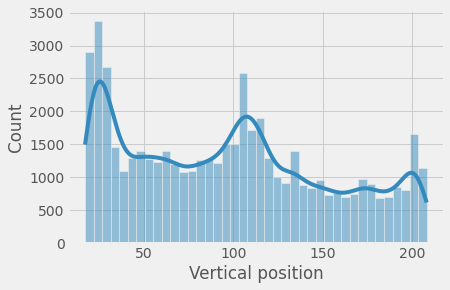
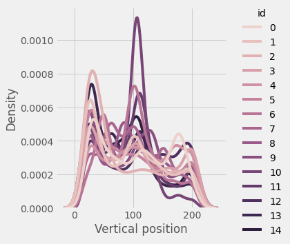
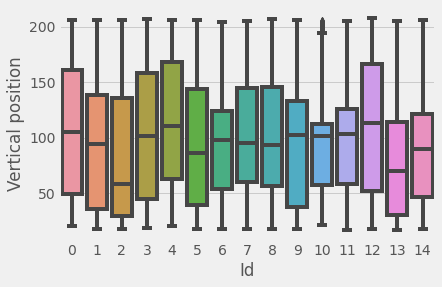
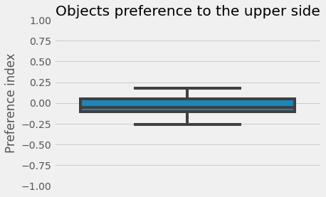
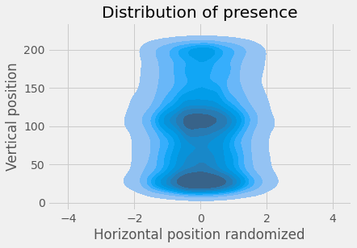
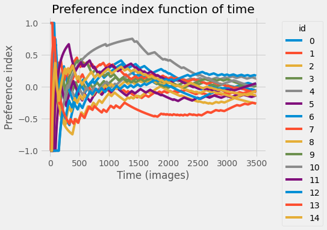

```
Copyright (C)  FastTrack.
Permission is granted to copy, distribute and/or modify this document.This program is distributed in the hope that it will be useful, but WITHOUT ANY WARRANTY; without even the implied warranty of MERCHANTABILITY or FITNESS FOR A PARTICULAR PURPOSE.
```
# Case study #1

Objective: track multiple D. Melanogaster and determine the time
 spent in the upper area of the experimental apparatus.
 Dataset: http://cloud.ljp.upmc.fr/datasets/TD2/#DRO_004
 
 <iframe width="560" height="315" src="https://www.youtube.com/embed/ZE9t_-h3VBM" title="YouTube video player" frameborder="0" allow="accelerometer; autoplay; clipboard-write; encrypted-media; gyroscope; picture-in-picture" allowfullscreen></iframe>

## Import the data


```python
import fastanalysis as fa
import seaborn as sns
import numpy as np
import matplotlib as mpl
plt.style.use("fivethirtyeight")
import warnings
warnings.filterwarnings('ignore')
```


```python
data = fa.Load("tracking.txt")
```

## Explore the tracking data


```python
# Distribution of vertical positions for all the objects
p0 = sns.histplot(data=data.getDataframe(), x="yBody", kde=True);
p0.set_xlabel("Vertical position");
```


    

    


```python
# Distribution of vertical positions for each individual
p1 = sns.displot(data=data.getDataframe(), x="yBody", hue="id", kind="kde");
p1.ax.set_xlabel("Vertical position");
```


    

    


```python
p2 = sns.boxplot(data=data.getDataframe(), x="id", y="yBody");
p2.set_xlabel("Id");
p2.set_ylabel("Vertical position");
```


    

    


## Compute the preference


```python
# For each individual computes a preference index
pi = []
for i in range(data.getObjectNumber()):
    dat = data.getObjects(i)
    dat.loc[:, "diffTime"] = dat.imageNumber.diff().values
    up = dat[dat.yBody > 100]
    down = dat[dat.yBody <= 100]
    pi.append((up.diffTime.sum() - down.diffTime.sum())/(up.diffTime.sum() + down.diffTime.sum()))
```


```python
p3 = sns.boxplot(y=pi)
p3.set_ylim(-1, 1)
p3.set_ylabel("Preference index");
p3.set_title("Objects preference to the upper side");
```


    

    


```python
p4 = sns.kdeplot(data=data.getDataframe(), x=np.random.normal(size=data.getDataframe().values.shape[0]), y="yBody", fill=True);
p4.set_xlabel("Horizontal position randomized");
p4.set_ylabel("Vertical position");
p4.set_title("Distribution of presence");
```


    

    


```python
pi = []
for i in range(data.getObjectNumber()):
    dat = data.getObjects(i)
    dat.loc[:, "diffTime"] = dat.imageNumber.diff().values
    pref = []
    for l, __ in enumerate(dat.yBody.values):
        up = dat[0:l][dat[0:l].yBody.values > 100]
        down = dat[0:l][dat[0:l].yBody.values <= 100]
        pref.append((up.diffTime.sum() - down.diffTime.sum())/(up.diffTime.sum() + down.diffTime.sum()))
    pi.append(pref)
```


```python
for i, j in enumerate(pi):
    p5= sns.lineplot(x=np.arange(len(j)), y=j, label=str(i))
p5.set_xlabel("Time (images)"); 
p5.set_ylabel("Preference index");
p5.set_title("Preference index function of time");
p5.legend(title="id", bbox_to_anchor=(1.05, 1));
```


    

    

