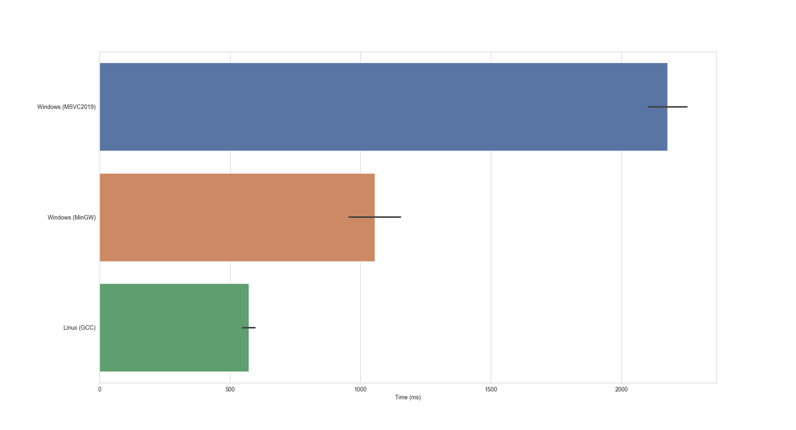
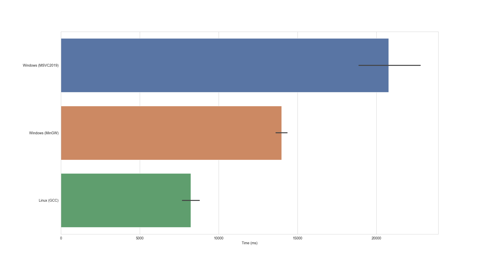
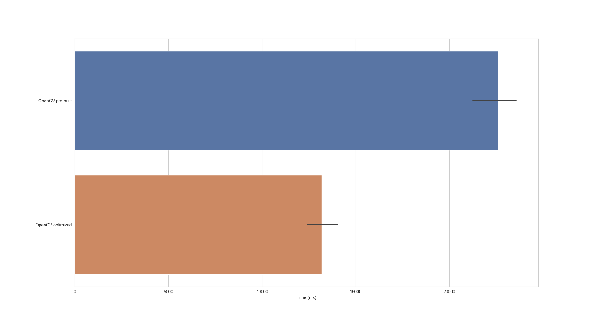
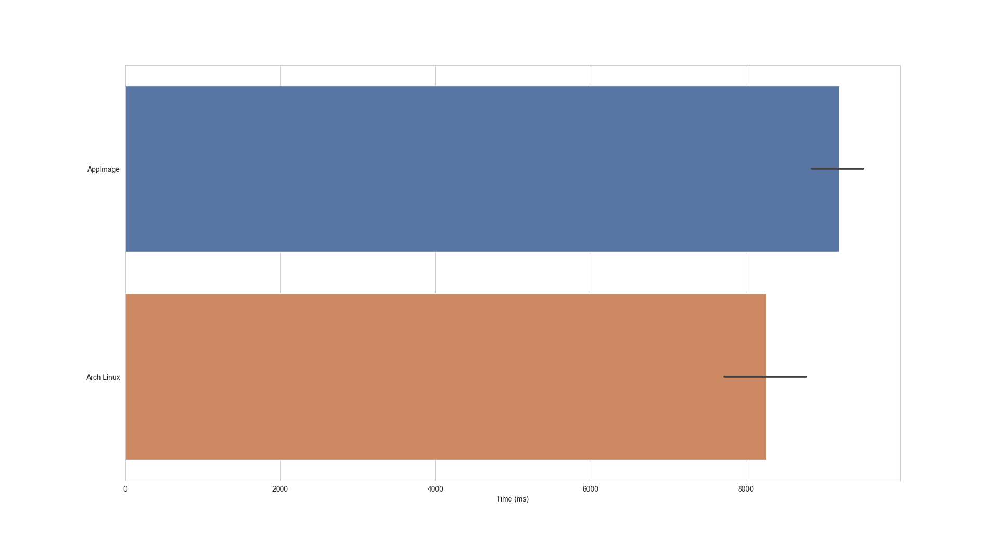

```
Copyright (C)  FastTrack.
Permission is granted to copy, distribute and/or modify this document. This program is distributed in the hope that it will be useful, but WITHOUT ANY WARRANTY; without even the implied warranty of MERCHANTABILITY or FITNESS FOR A PARTICULAR PURPOSE.
```


## FastTrack performance comparison between Linux and Windows

FastTrack is a multi-platform application available for Linux, macOS, and Windows. In this post, we will compare the performance of the Linux and Windows versions. We will see that the performance depends a lot on how OpenCV was built and how to build it for performance.

### The setup

The benchmark will be performed using FastTrack version 6.1.1 on a computer with an Intel(R) Core(TM) i7-8565U and 16Go of RAM.  
The Linux version was compiled using the GCC compiler with the default release flag of Qt. We used two Windows compilers: MSVC 2019 used for the FastTrack stable release, and MinGW_64 (GCC for Windows. MinGW_64 is not used for binary releases because it lacks the QtWebEngine package but a lighter version of FastTrack can be compiled using the NO_WEB compilation flag). 
We use OpenCV 4.5.5 and Qt 6.2.2 to perform the benchmark. We chose the test dataset of FastTrack ZFJ_001 with the parameters included with it and the PAR_001 from the two-dimensional dataset.

### Results

The results of the benchmark are displayed in Figure.1 for ZFJ_001 and Figure.2 for PAR_001. We see that the tracking is significantly slower on Windows than on Linux and that the MinGW_64 compiler yield better performance than MSVC2019.  

|  |
|:--:|
| Figure 1. Benchmark for ZFJ_001. |


|  |
|:--:|
| Figure 2. Benchmark for PAR_001. |

These results can be explained by several factors. First, compiler optimizations are not the same and it seems that out-of-the-box Qt and OpenCV are generally faster with GCC. Another point is that FastTrack writes heavily on the disk using both the SQLite database and plain text files. I/O performance varies widely depending on operating system and hardware and is generally better on Linux. 

In our case, we can pinpoint a large part of the performance difference to the core operations of the tracking (object detection and ellipse computation) powered by OpenCV that are significantly slower on Windows.

### What we can do

Performance can be improved by tweaking compiler optimization flags and compiling OpenCV using system-specific optimizations if available.

Figure.3 presents the performance for the pre-built OpenCV library and the optimized version compiled with MSVC2019. Optimized OpenCV was compiled with TBB, OpenMP, and IPP enabled and is 1.7 times faster than the pre-built version but still 1.6 times slower than the Linux version.

|  |
|:--:|
| Figure 3. Pre-built vs omptimized OpenCV library (PAR_001). |

On Linux, OpenCV is compilated as packaged by the Linux distribution. For example, [ArchLinux](https://github.com/archlinux/svntogit-packages/blob/packages/opencv/trunk/PKGBUILD) and [Ubuntu](https://launchpadlibrarian.net/573124241/buildlog_ubuntu-jammy-amd64.opencv_4.5.4+dfsg-9ubuntu2_BUILDING.txt.gz) are not packaged with the same flags enabled and there is still room for performance improvement. In Figure.4, we compare the performance of the AppImage packaged on Ubuntu with the ArchLinux version available on AUR. We see that the native package is slightly faster than the AppImage but still performing very well.

|  |
|:--:|
| Figure 4. AppImage vs Arch Linux package from AUR (PAR_001). |

### Final words

Pre-built binaries of FastTrack will most likely perform better on Linux than on Windows for equivalent hardware. Most Linux distributions will provide a pre-built OpenCV library well optimized whereas FastTrack for Windows is built against the pre-built OpenCV library for MSVC. 
A custom compilation of OpenCV and FastTrack with platform-specific optimizations will provide maximum performance in any case.   
Ultimately, switching to MinGW_64 will be the only way to start to fill the performance gap on Windows. In the next post, we will see how to compile OpenCV and (light) FastTrack with MinGW_64 and if it is possible to have performance as best as the standard Linux version.

### Reference

[OpenCV compilation flags](https://docs.opencv.org/4.5.5/db/d05/tutorial_config_reference.html)
