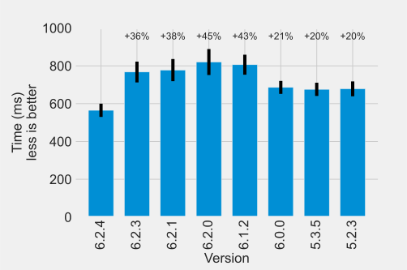

In this post, we will use [Hyperfine](https://github.com/sharkdp/hyperfine) to compare the performance of several versions of FastTrack to see how FastTrack performance has improved or degraded over time.

## Methods

We will automate the benchmark with a python script that will:
1. Select the FastTrack version.
2. Compile FastTrack.
3. Run hyperfine.

```python
  1 import os
  2
  3 def compile(versions, cmd):
  4   for i in versions:
  5     os.system("make distclean -s")
  6     os.system("git checkout -f v{}".format(i))
  7     if i[0] == "6": # Choose qt version
  8       os.system("qmake6 CONFIG+=release src/FastTrack-Cli.pro")
  9     elif i[0] == "5":
 10       os.system("qmake CONFIG+=release src/FastTrack-Cli.pro")
 11     os.system("make")
 12     os.system("make clean")
 13     os.system("mv build_cli {}".format(i))
 14     cmd += "\'{}/fasttrack-cli --path test/dataSet/images/frame_000001.pgm --cfg test/dataSet/images/Groundtruth/Tracking_Result/cfg.toml\' ".format(i)
 14   return cmd
 15
 16 versions = ["6.2.4", "6.2.3", "6.2.1", "6.2.0", "6.1.2", "6.0.0", "5.3.5", "5.2.3"]
 17 cmd = compile(versions, "hyperfine -w 20 -m 100 ")
 18 os.system("git checkout -f master")
 19 os.system(cmd + "--export-markdown benchmark.md")
```

## Results

The results of the benchmark are displayed in the graph below with horizontally the version of FastTrack (left is the more recent), and vertically the mean time to perform 50 tracking analyses of the test dataset (less time is better). We can see two interesting breakpoints of performance.



The fastest version is by far the 6.2.4 (latest at the time of writing). This is due to the optimized rewriting of a core function of the tracking. This function computes the object's direction and is used ~nObject\*nImage times. A slight gain can greatly impact the overall performance.

We see a degradation of performance between versions 6.0.0  and 6.1.2. This degradation was introduced when FastTrack started to use the SQLite database as a backend. In version 6.0.0 and prior, tracking data were directly saved as a plain text file. This was fine for the tracking but loading the data for reviewing was consuming a lot of RAM and was very slow. Version 6.1.0 and later introduced an SQLite database to store the tracking data but still keep the plain text file for compatibility. This development choice increased performance for the tracking review but slightly degraded the tracking time. Inserting data in the database is faster but generating and writing the text file needed to keep the compatibility introduces a small time overhead degrading the tracking performance. Overall, tracking plus reviewing was faster.

Less significantly, we see a slight increase in performance between versions 6.1.2 and 6.2.3 caused by small optimizations in the code. We see also that migrating from Qt5 (FastTrack 5.3.5 and prior) to Qt6 (FastTrack 5.3.5 and later) doesn't change the performance.

## Conclusion

A tracking analysis is the repetition of a few functions on a lot of images. Marginal gains on these functions can cumulate to a large increase in tracking speed. We work to increase the overall performance with each release of FastTrack and there is still gain to be found.

