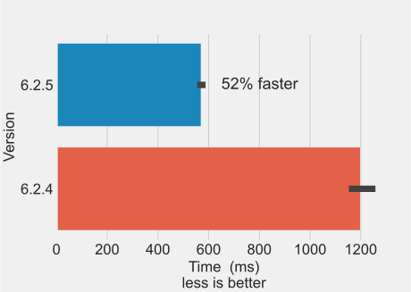

As mentioned in previous posts, FastTrack on Windows is slow compared to the Linux and macOS versions. Since version 6.2.5, the tracking speed dramatically improved on Windows.

## Problem

One user reported a bug involving a [memory leak on Windows]( https://github.com/FastTrackOrg/FastTrack/issues/48) for a specific video format. We investigated this bug and were able to find that it came from the OpenCL library. OpenCL was unable to share a buffer leading to multiple deep copies of images and ultimately a RAM overload. This bug was restricted to the tracking class and reproducible only with a specific video. A hotfix was deployed by deactivating OpenCL.  
As usual, we run the performance benchmark and no changes were seen... except for Windows (see graph). Surprisingly, deactivating OpenCL increases tracking performance by 52% on Windows.  

## OpenCL

"[OpenCL](https://www.khronos.org/opencl/) (Open Computing Language) is a framework for writing programs that execute across heterogeneous platforms" CPUs, GPUs, DSPs, and FPGAs. [OpenCV uses OpenCL](https://opencv.org/opencl/) by the mean of the transparent API that adds hardware acceleration with a minimal change in the code (use UMat instead of Mat to store images). Using hardware acceleration can increase performance when expensive operations are applied to the image, otherwise, the overhead time to moving the data to the GPU dominate.  
There is numerous posts ([1](https://discuss.pixls.us/t/darktable-3-4-3-5-opencl-slow-on-windows-10/25309/19),[2](https://community.khronos.org/t/opencl-on-windows-much-slower-than-on-mac/2100)) on the internet that talk about performance issues with OpenCL. Only one thing is certain, deactivating OpenCL in FastTrack leads to consistent performance across platforms.
