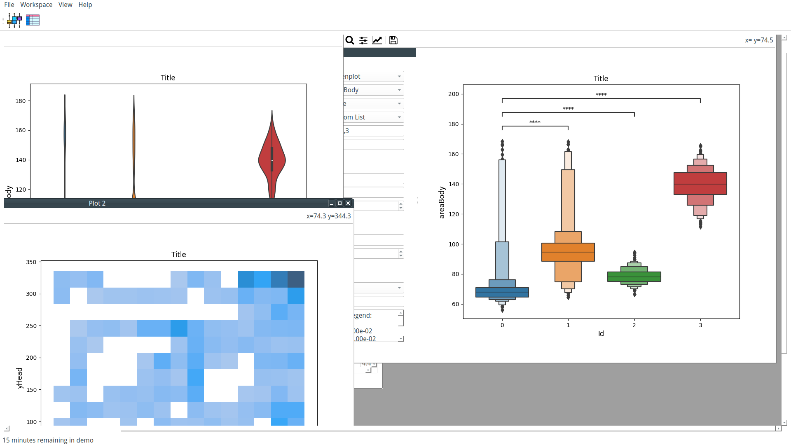
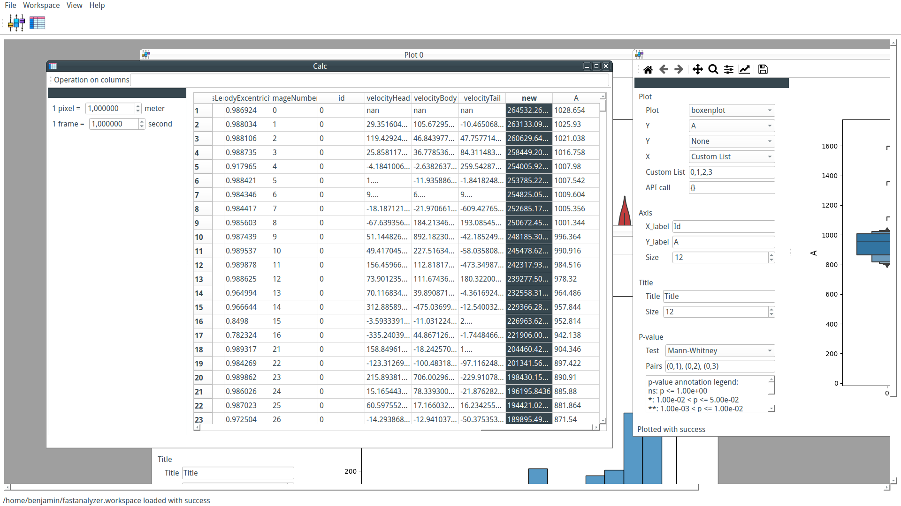
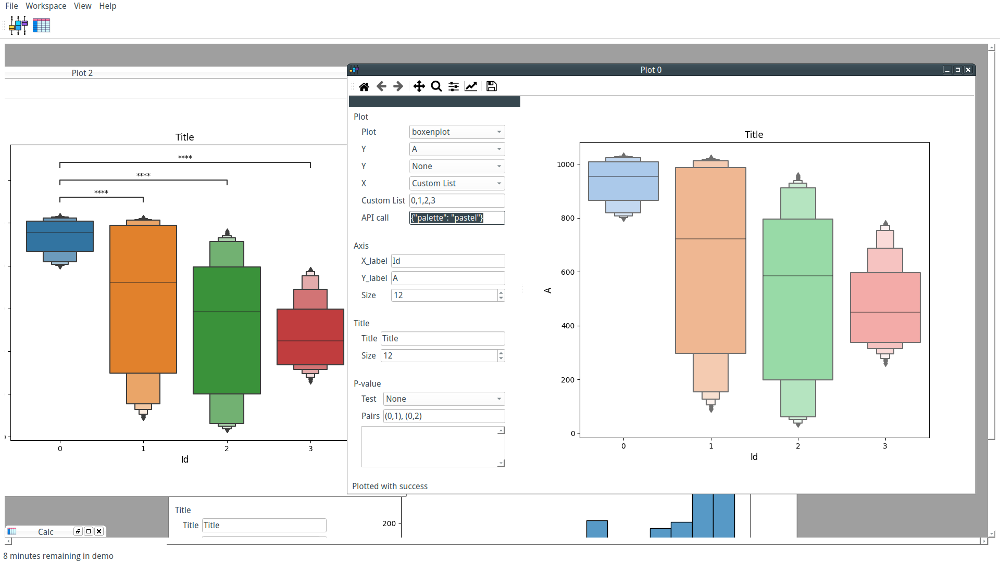
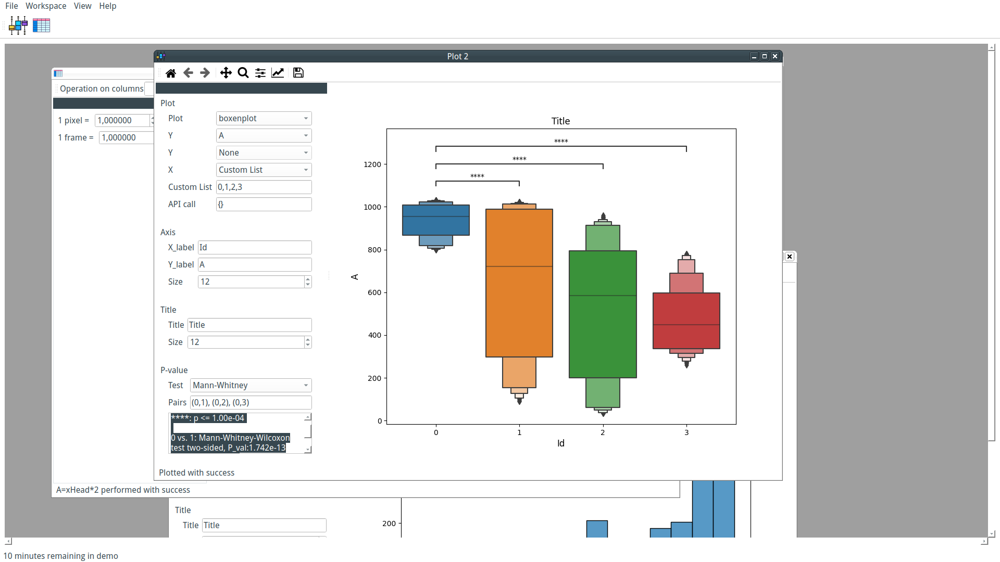

The first round of coding for FastAnalyzer is now over. The first alpha version is distributed as a binary for Windows, Linux, and macOS. The public alpha is restricted to 30 minutes of usage, and can be downloaded at https://www.fasttrack.sh/download/Continuous/FastAnalyzer_public_alpha/ with a test dataset. To access the private alpha with unlimited time, behind the scene coding and direct feedback, become a [Supporter](https://ko-fi.com/summary/76416cef-1fd2-4ec2-aaa7-68342b5b2ddd).
In this first cycle, we implemented several essential features that we will detail below.

## Project state

### Interface

FastAnalyzer interface is an MDI. This interface allows us to see and compare several plots in one glance. That means that each new plot is a unique window inside the interface. Windows can be displayed as tabs or in separate windows (they can be tiled or cascaded). Changes in the data are directly visible in every plot window.

### Data loading

Tracking data from FastTrack (.db and .txt) can be loaded in FastAnalyzer.  Once loaded, modified tracking data and plots can be saved as a "workspace" saved and can be reloaded next time. It allows the user to switch seamlessly between several analyses.

### Data modification

Tracking data can be modified using the Calc window. New columns can be created using columns operation. for example, `new = xHead**2` will create a new column named new. Regular Pandas operations are supported like sqrt(), diff(), etc.
It is also possible to apply a scale to the tracking data to convert pixels and images in meters and seconds.

### Data plotting

Plotting data is the main feature implemented in FastAnalyzer. It supports univariate and bivariate distributions (kdeplot, displot, histplot), and descriptive plot (boxplot, violinplot, boxenplot, swarmplot). Simple features like title, labels, and label size are directly modifiable in the interface. For more advanced users, it is possible to write in the interface a Python dictionary that will be passed in the plot function to call directly advanced features. For example, changing the color palette can be done by writing `{"palette": "pastel"}` in the lowLevelApi field.

### Data statistical significance

P-values calculation using several standard tests are implemented. Choose the test, write the pair where you want to test, for example, `(0,1), (0,2)`, and FastAnalyzer will directly draw the result on the plot and the detail of the test in the interface.

## Conclusion

The first round of development of FastAnalyzer already offers a software that can produce standard academic plots with statistical significance tests, adjustable titles, and labels.
After some first feedback from users, the second round of development will tackle the software performance and robustness with the development of a test suite.
