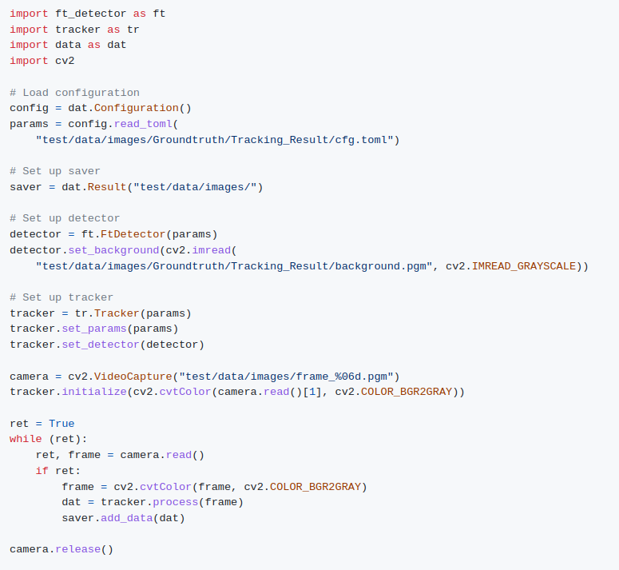

## PyFastTrack

### Presentation

PyFastTrack is an open-source Python library that provides the tracking technology of FastTrack in a more modular and customizable way. The parameters and results files are compatible with FastTrack, so analysis performed with PyFastTrack can be reviewed using FastTrack.
The library is articulated around two mains class: a base detector and a tracker. The user can implement the base detector and then use it in the tracker to perform the tracking. This modular implementation will facilitate the integration of FastTrack in projects that need more flexibility than the C++ API.

### Next week

The project's current state of development is that the primary foundation blocks are coded. The FastTrack detector and the tracker are implemented and can produce comparable results as FastTrack. For now, PyFastTrack and FastTrack have the same results but with an incertitude of 0.001 pixels and radian on the body ellipse and 0.01 pixels and radian on the head and tail ellipses. However, PyFastTrack is much slower than FastTrack. Supporters can see this week's video update on [Kofi](https://ko-fi.com/post/PyFastTrack-DevWeek1-U7U1KOVYD) for more detail on the first results and a demonstration of the project's current state.

### Roadmap

The project's main focus in the next week will be to optimize PyFastTrack to perform the tracking faster and reach the point of the first public release. In the next few weeks, we will add a deep learning detector (YOLOv8 instance segmentation) so scenes with complex backgrounds can be processed more efficiently, bringing FastTrack into the deep learning era.

Finally, we would like to thank the backers on Kofi: Leonardo Rodriguez-Sosa, and Sushmitha Arumugam, who has supported the development of PyFastTrack. With their contributions, the project can move forward more quickly. Thank you!

